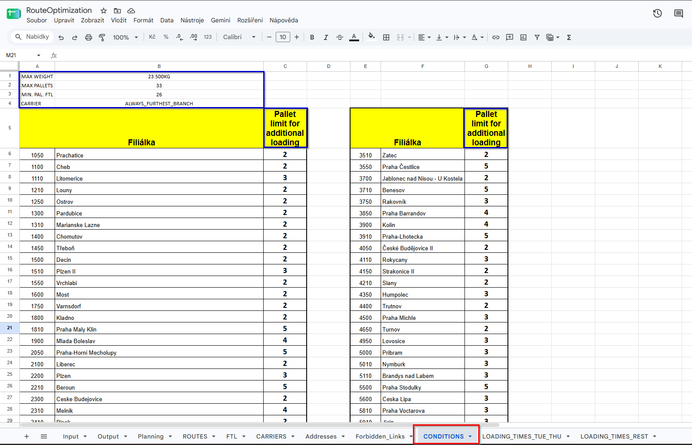
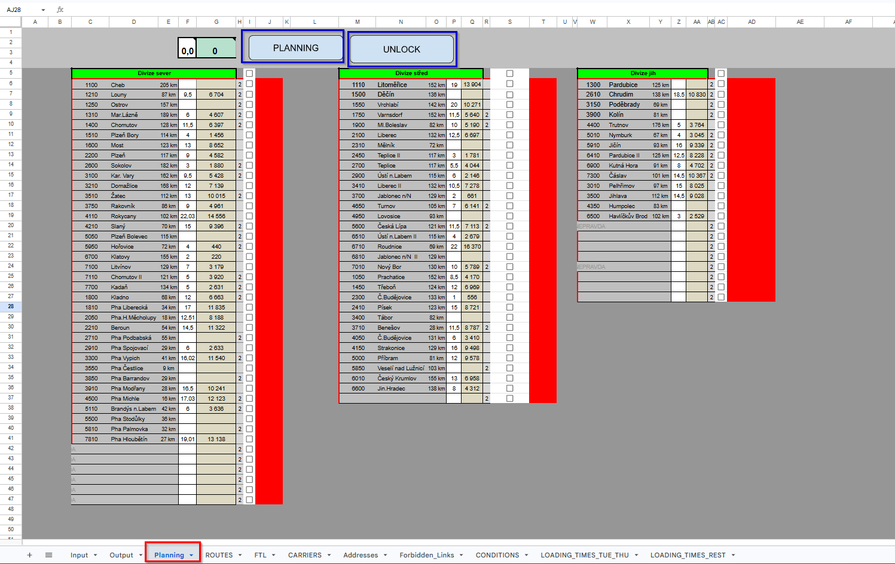
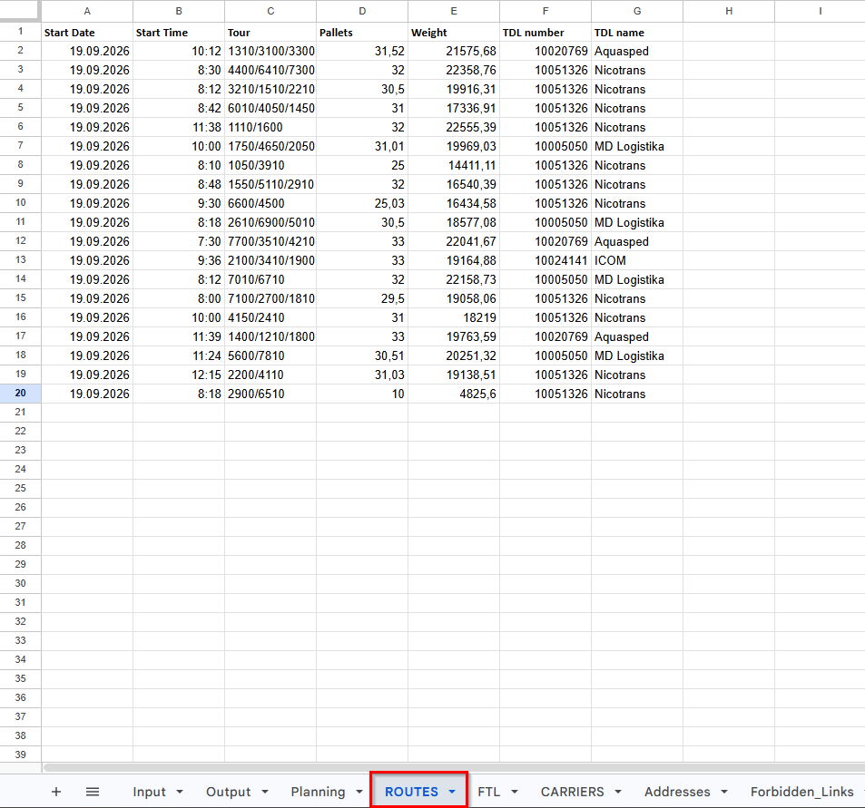

# Logistics Route Optimization & Automation (Google Apps Script)

A powerful, fully automated logistics and dispatching tool built directly inside Google Sheets. This project uses a **Best-Fit Algorithm** and the **Google Maps API** to automate the daily routing of freight, drastically reducing manual planning time while maximizing truck capacity.

## Key Features

*   **Automatic FTL (Full Truckload) Extraction:** 
    Automatically scans incoming orders and filters out shipments that exceed configurable weight or pallet limits, moving them directly to a dedicated FTL sheet.
*   **Smart LTL (Less Than Truckload) Consolidation:** 
    Uses a custom Best-Fit algorithm to group remaining smaller shipments into optimal multi-stop routes without exceeding maximum weight or pallet constraints.
*   **Google Maps API Integration:** 
    Calculates driving distances between branches in real-time. Ensures that any multi-stop detours do not exceed a strict 15% limit compared to the direct route.
*   **Dynamic Constraint Engine:** 
    Fully configurable via a "CONDITIONS" control panel in the spreadsheet. Supports:
    *   Forbidden branch combinations.
    *   Mandatory minimum volume thresholds for specific branches.
    *   Corridor matching (grouping branches on the same geographical axis).
    *   Dynamic carrier assignment (e.g., assigning the carrier based on the furthest branch or the branch with the most pallets).
*   **Dictionary Caching & Performance:** 
    Implements memory caching for carrier assignments and geographical distances to prevent API timeouts and ensure execution in milliseconds.

## 📸 User Interface & Workflow

Here is how the system looks directly inside Google Sheets:

**1. Dynamic Control Panel (Conditions)**
Easily configurable constraints without touching the code. Limits, rules, and rules can be adjusted on the fly.

**2. One-Click Planning Dashboard**
The main interface where dispatchers trigger the Export, Optimization, and Reset functions.

**3. Automated Output (Routes & FTL)**
The final generated routes with automatically assigned carriers and loading times.

## Tech Stack

*   **JavaScript (ES5/ES6 concepts)**
*   **Google Apps Script (GAS)**
*   **Google Sheets** (as a lightweight database and UI)
*   **Google Maps Direction API**

## Project Structure

The codebase is modularized for better maintainability:

1.  `DataExport.gs` - Handles data aggregation from the Input sheet, extracts FTLs, and prepares the LTL remainders for planning.
2.  `RouteOptimization.gs` - The core algorithmic brain. Handles the Best-Fit sorting, Google Maps distance checks, constraint validations, and final route generation.
3.  `ResetData.gs` - Utility functions for quickly clearing daily operational data to provide a "clean slate" for the next dispatching shift.

## How It Works (Business Logic)

1.  **Input Phase:** Dispatchers paste the raw daily transport requirements (Branch ID, Pallets, Weight) into the `Input` sheet.
2.  **Export & Filter:** The system groups orders by branch. If an order crosses the FTL threshold (e.g., >26 pallets or >23,500 kg), it is separated.
3.  **Optimization:** The algorithm sorts the remaining branches by distance. It takes the furthest branch and searches for valid co-loads along the same corridor, ensuring weight/pallet limits and minimum detour rules are strictly respected.
4.  **Result:** Optimized routes are written to the `ROUTES` sheet with automatically assigned carriers and loading times.

## Live Demo
*(Note: If you want to try it yourself, you can make a copy of the public Google Sheet template here: `https://docs.google.com/spreadsheets/d/1snmRcfiafsXOM53xA_qjvuO9FCXmlXXfyWuR2qV69u4/edit?gid=0#gid=0)`

---
*Created as a demonstration of applying algorithmic thinking and process automation to real-world supply chain challenges.*

